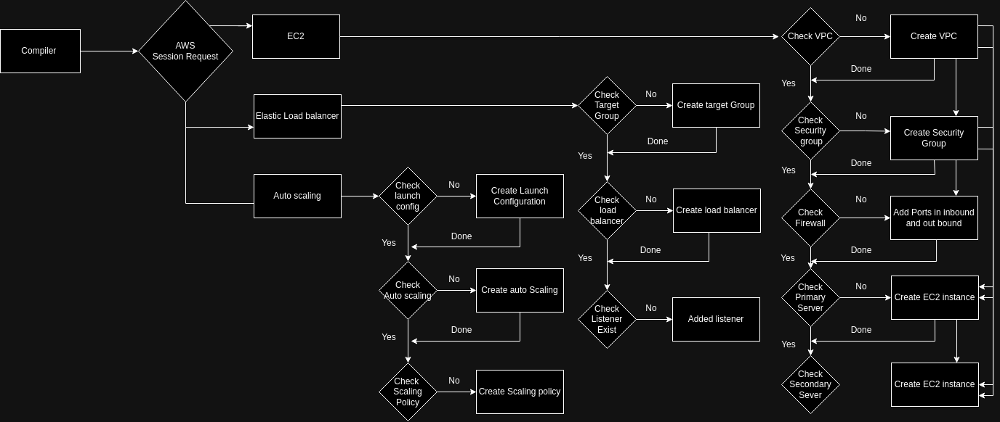

# Web Application Deployment and Management System
## Overview
This project aims to develop a system that automatically manages the lifecycle of a web application hosted on EC2 instances. The system monitors the application's health, reacts to traffic changes by scaling resources, and sends notifications to administrators regarding the infrastructure's health and scaling events.

Detailed Breakdown
1. Web Application Deployment
S3 Bucket Creation

Use boto3 to create an S3 bucket for storing the web application's static files.
EC2 Instance Launch and Configuration

Launch an EC2 instance using boto3.
Configure the EC2 instance as a web server (e.g., Apache, Nginx).
Deploy the web application onto the EC2 instance.

2. Load Balancing with ELB
Application Load Balancer Deployment
Deploy an Application Load Balancer (ALB) using boto3.
Register the EC2 instance(s) with the ALB.

3. Auto Scaling Group (ASG) Configuration
ASG Creation
Use boto3 to create an ASG with the deployed EC2 instance as a template.
Configure scaling policies to scale in/out based on metrics like CPU utilization or network traffic.

4. SNS Notifications
SNS Topic Setup

Set up different SNS topics for various alerts (e.g., health issues, scaling events, high traffic).
SNS and Lambda Integration

Integrate SNS with Lambda functions to send SMS or email notifications to administrators.

5. Infrastructure Automation
Deployment Script
Create a single script using boto3 that:
Deploys the entire infrastructure.
Updates any component as required.
Tears down the infrastructure when the application is no longer needed.


## Objectives
Gain a comprehensive understanding of key AWS services and their integration.Understand the lifecycle of a dynamic web application and its infrastructure.Learn how to automate infrastructure deployment and management tasks using boto3.Gain experience with real-time monitoring and alerting systems.

## Requirements
- Python: The project will use Python as the scripting language.
- boto3: AWS SDK for Python to interact with AWS services.
- AWS Account: Access to an AWS account with necessary permissions to create and manage resources.
- Web Application: A simple web application to deploy (e.g., a static website or a basic web server setup).

## Getting Started
- Set Up AWS Credentials

Configure your AWS credentials using the AWS CLI or by setting environment variables.

- Install Dependencies

Ensure boto3 is installed in your Python environment:
```python
pip install boto3
```
- Run the Deployment Script

Execute the deployment script to set up the infrastructure:

Architectural Diagram: 


```shell 
python deployment.py
```

- Monitor and Manage

Use the AWS Management Console or AWS CLI to monitor the deployed resources.
Review SNS notifications for any alerts regarding health or scaling events.
- Tear Down

When the application is no longer needed, run the script to tear down the infrastructure:
```shell 
python undeploy.py
```
